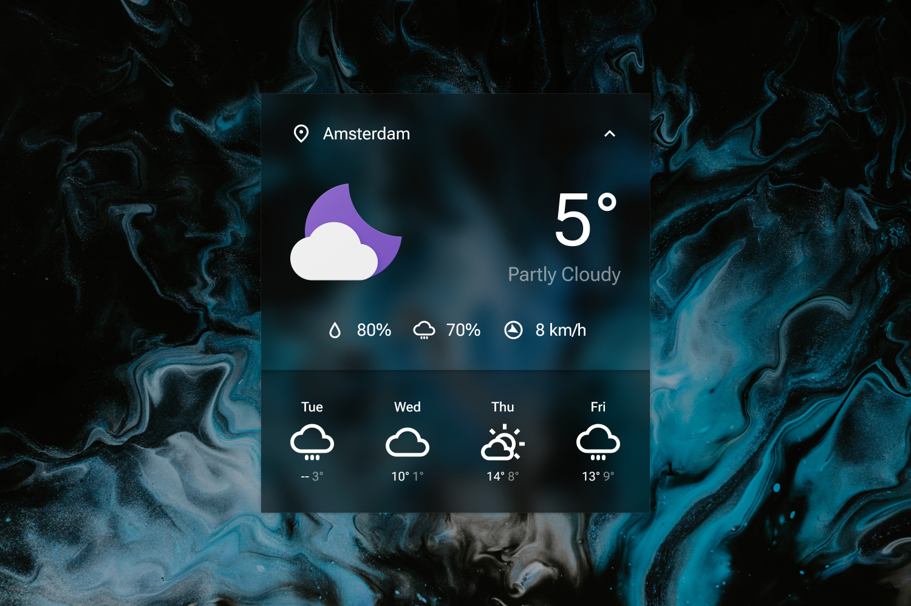

# Sienna 2.0

  
 

Totally not named after the MetArt model.

As always, right-click and hit "Settings..." to change the settings.

----

## Installation

1. Download and install the latest version of [Rainmeter](https://www.rainmeter.net/).  
2. Download the [skin](https://github.com/adriaanjelle/Sienna-2.0/releases/latest) and open the .rmskin file (it should have a green raindrop icon).  
3. Done!
